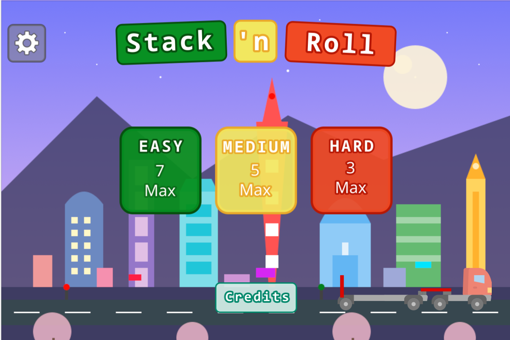
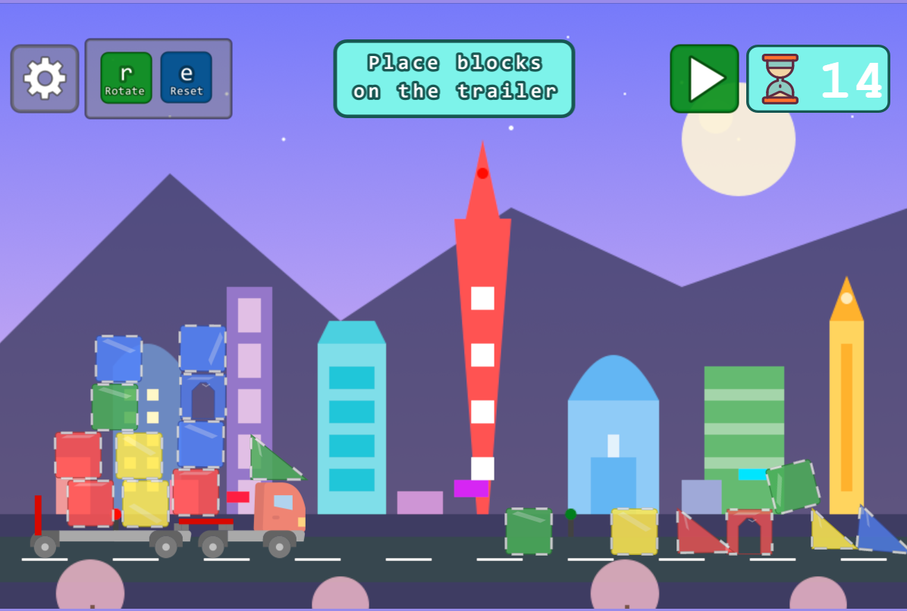
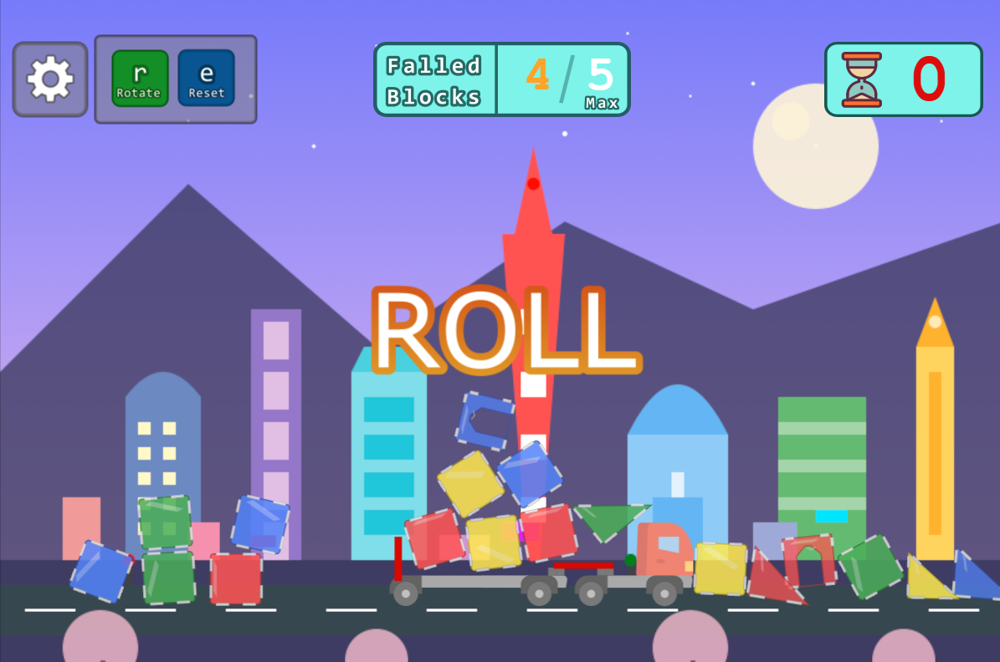

# Stack 'n Roll'

Stack'nRoll is a game that make your build skill in pressure.

Make sure your stack is place correctly, otherwise block will fall after the countdown.

The game was creat for the #gamedevjs 2025.

## Goal

The purpose of the game is to stack block on the trailer before the countdown.
When it timeouts the truck moves and some blocks will fall.
To win the round, you need to have less block that the max.
Sample: you select the normal level, the max fall block is 5, you win if there are less fall block
than the max level.

## How to play

- Select a level
- Place the block on the trailer
- You can rotate, reset block rotation it is usefully for triangle one.
- Wait the countdown timeout

## How to run project
The project is a vanilla javascript, so you just have to
- `yarn install`
- `yarn dev`